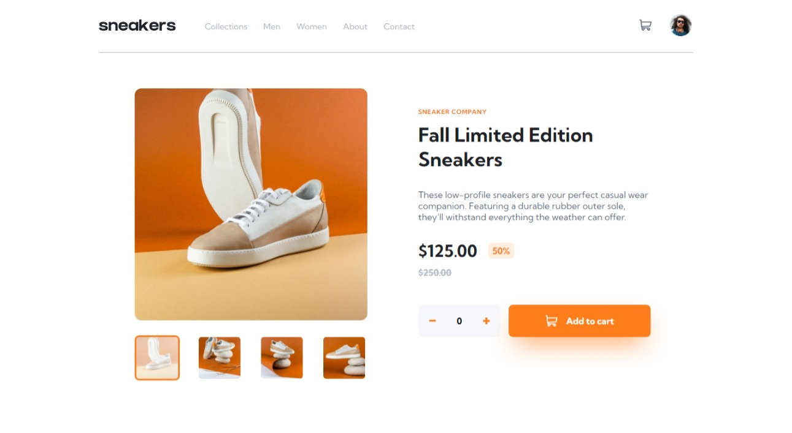
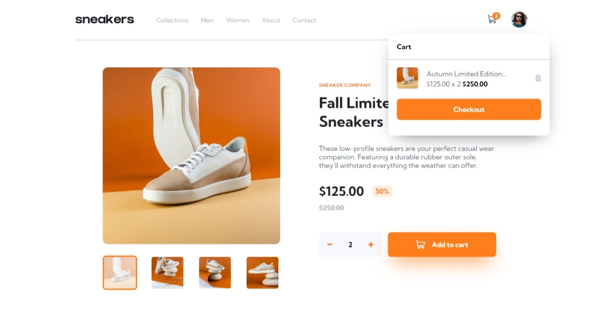
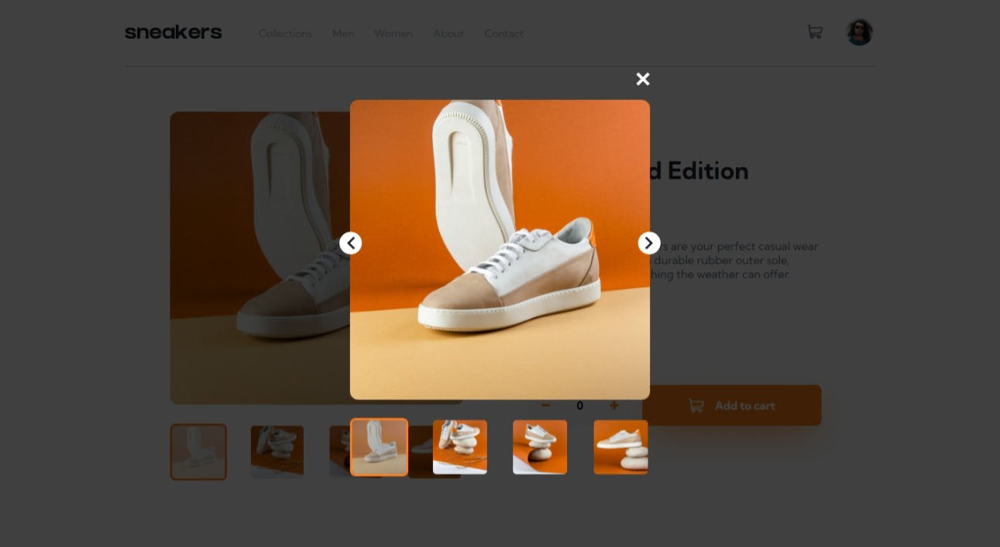
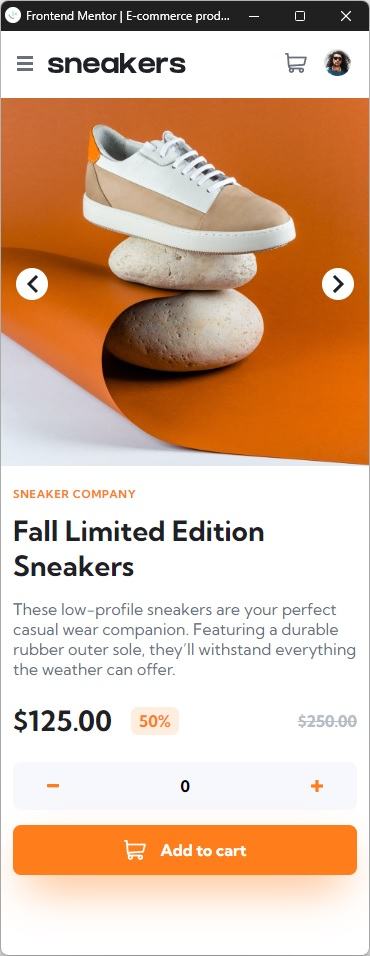
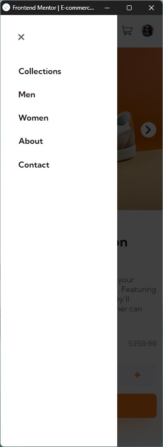
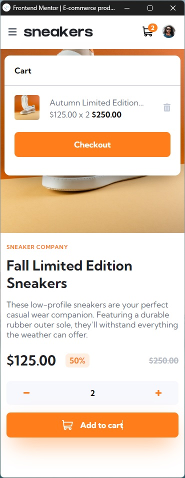

# Frontend Mentor - E-commerce product page solution

This is a solution to the [E-commerce product page challenge on Frontend Mentor](https://www.frontendmentor.io/challenges/ecommerce-product-page-UPsZ9MJp6). Frontend Mentor challenges help you improve your coding skills by building realistic projects.

## Table of contents

- [Overview](#overview)
  - [The challenge](#the-challenge)
  - [Screenshot](#screenshot)
  - [Links](#links)
- [My process](#my-process)
  - [Built with](#built-with)
  - [What I learned](#what-i-learned)
- [Author](#author)
- [Acknowledgments](#acknowledgments)

**Note: Delete this note and update the table of contents based on what sections you keep.**

## Overview

### The challenge

Users should be able to:

- View the optimal layout for the site depending on their device's screen size
- See hover states for all interactive elements on the page
- Open a lightbox gallery by clicking on the large product image
- Switch the large product image by clicking on the small thumbnail images
- Add items to the cart
- View the cart and remove items from it

### Screenshot

- Desktop Design

- Desktop Cart

- Desktop Overlay

- Mobile Design

- Mobile Nav

- Mobile Cart

### Links

- Solution URL: [Github Repo](https://github.com/ravindra135/FrontEndMentor-ecommerce-product-page-main/)
- Live Site URL: [Live Here](https://ravindra135.github.io/FrontEndMentor-ecommerce-product-page-main/)

## My process

### Built with

- Semantic HTML5 markup
- CSS custom properties
- Flexbox

### What I learned

- Resonsive Layout;
- CSS Custom Properties;
- Animation **@keyframes** in css;
- Wroking with Arrays in JS.
- Constructing Dynamic Data;
- Animation with JS;

## Author

- Frontend Mentor - [@ravindra135](https://www.frontendmentor.io/profile/ravindra135)
- Github - [@ravindra135](https://github.com/ravindra135/)
- Instagram - [@ravindra_since2k](https://www.instagram.com/ravindra_since2k/)

## Acknowledgments

I Would like to thanks, FrontEnd Mentor itself because of its challenges I have boosted confidence in my skills. This challenge helped me to Learn some advanced CSS properties, some Javascript Tricks. Thank You **Kevin Powell** for suggesting the *FrontEnd Mentor* platform. This Challenge wont be completed with the Help of ***StackOverFlow Community***;
